# Biomass-Predictor

The repository contains for training models to predict biomass from plots from a multispectral image. 

# Code Structure
```
.
├── assets
|   ├── data_loader.py
|   ├── feature_engineering.py
|   ├── model.py
|   └── utils.py
├── outputs
|   ├── models
|   └── plots
├── .gitignore
├── License
├── main.py
└── README.md
```
1. `assets/`: Contains all the helper functions for data loading, feature engineering, model training and evaluation.
2. `outputs/`: Contains the trained models and the plots of the model evaluation.
3. `main.py`: Main script to run the model training and evaluation.
4. `README.md`: Contains the information about the repository.

# Model Training & Experimentations

1. The dataset is split into 90% training and 10% testing.

2. Features are standardized using StandardScaler.

3. Features engineering is done to create new features creating another dataset containing initial features and the new features. New features include:
    -  Enhanced Vegetation Index (EVI)
    -  Soil Adjusted Vegetation Index (SAVI)
    -  Normalized Difference Water Index (NDWI)
    -  Simple Ratio (SR)
    -  Green Chlorophyll Index (GCI)
    -  Normalized Difference Red Edge (NDRE)
    -  Normalized Difference Vegetation Index (NDVI)

    <!-- correlation analysis on initial features and feature engineered features -->
    - **Correlation Analysis of Initial Features**
    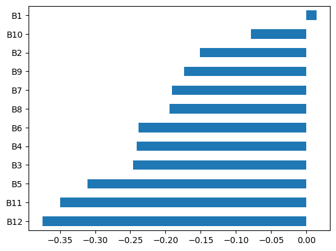

    - **Correlation Analysis of Updated Features**
    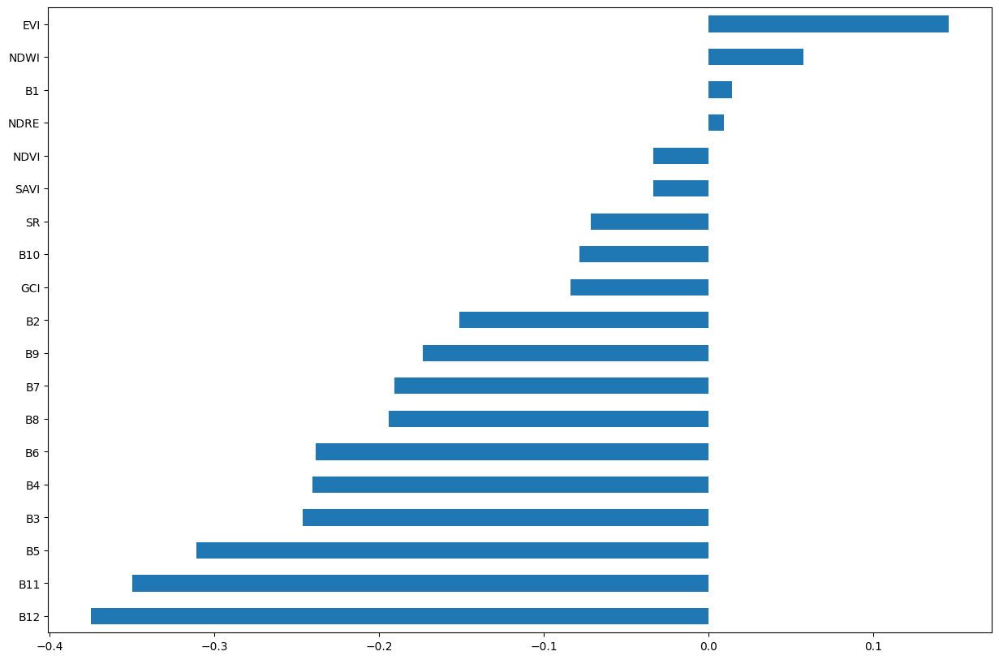


4. Dimensionality reduction is done using **PCA** to select the most important features for both datasets.

3. Models are trained on the features and the reduced features for each of the datasets.

4. The models are evaluated using the **Mean Squared Error**, **R2 Score**, **Mean Absolute Error** and **Root Mean Squared Error**.

5. Models used for training are:
    - Linear Regression
    - Lasso Regression
    - Ridge Regression
    - Elastic Net
    - Decision Tree
    - Random Forest
    - Support Vector Machine
    - XGBoost
    - ANN (MLP)
        - The ANN model has 3 hidden layers with 128, 64 and 32 neurons respectively. The activation function used is ReLU and the output layer has a single neuron with a linear activation function.
        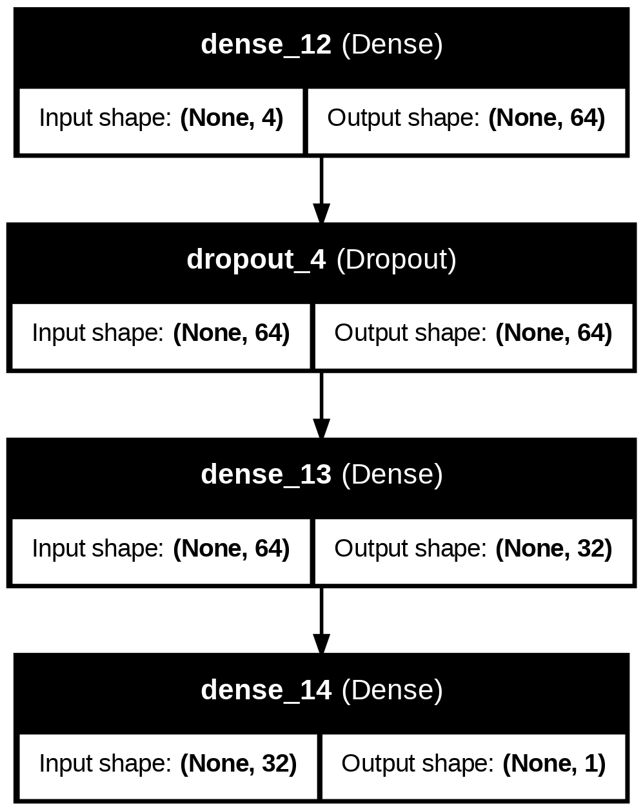

# Results

The results of the models are as follows:

## 1. Initial Dataset

| Model                   | MSE    | R2 Score | MAE    | RMSE   |
|-------------------------|--------|----------|--------|--------|
| Linear Regression       | 0.0162 | 0.0754   | 0.0938 | 0.1271 |
| Lasso Regression        | 0.0094 | **0.4649**   | 0.0696 | 0.0967 |
| Ridge Regression        | 0.0087 | **0.5039**   | 0.0670 | 0.0931 |
| Elastic Net             | 0.0091 | **0.4806**   | 0.0681 | 0.0953 |
| Decision Tree           | 0.0328 | -0.8777   | 0.1249 | 0.1812 |
| Random Forest           |  0.0208 | -0.1925  | 0.0982 | 0.1444 |
| Support Vector Machine  | 0.0166 | 0.0529   | 0.0992 | 0.1287 |
| XGBoost                 | 0.0179 | -0.0251   | 0.1015 | 0.1339 |
| ANN                     | 0.1009 | 0.0374   | 0.0168 | 0.1297 |


## 2. Reduced Features for Initial Dataset

| Model                   | MSE    | R2 Score | MAE    | RMSE   |
|-------------------------|--------|----------|--------|--------|
| Linear Regression       | 0.0114 | **0.3501**   | 0.0840 | 0.1066 |
| Lasso Regression        | 0.0120 | **0.3135**   | 0.0861 | 0.1096|
| Ridge Regression        | 0.0121 | 0.3077   | 0.0872 | 0.1100 |
| Elastic Net             | 0.0120 | **0.3120**   | 0.0862 | 0.1097 |
| Decision Tree           | 0.0498 | -1.8475   | 0.1836 | 0.2231 |
| Random Forest           | 0.0357 | -1.0441   | 0.1485 | 0.1890 |
| Support Vector Machine  | 0.0162 | 0.0716   | 0.1004 | 0.1274 |
| XGBoost                 | 0.0248 | -0.4180   | 0.1300 | 0.1574 |
| ANN                     | 0.1422 | -0.1573  | 0.0202 | 0.1422 |


## 3. Updated Features Dataset

| Model                   | MSE    | R2 Score | MAE    | RMSE   |
|-------------------------|--------|----------|--------|--------|
| Linear Regression       |  0.0245 | -0.3314   | 0.1373 |  0.1564 |
| Lasso Regression        | 0.0156 | **0.1507**   | 0.0992 |  0.1249 |
| Ridge Regression        | 0.0166 | **0.0967**  | 0.1001 |  0.1288 |
| Elastic Net             |  0.0177 | **0.0369**  | 0.1047 | 0.1330 |
| Decision Tree           | 0.0454 | -1.4709   | 0.1457 | 0.2131 |
| Random Forest           | 0.0357 | -0.9443   | 0.1314 | 0.1890 |
| Support Vector Machine  |  0.0296 | -0.6102   | 0.1225 | 0.1720 |
| XGBoost                 |  0.0280 | -0.5227   | 0.1288 |  0.1673 |
| ANN                     | 0.1028 | 0.0206   | 0.0180 | 0.1341 |


## 4. Reduced Features for Updated Features Dataset

| Model                   | MSE    | R2 Score | MAE    | RMSE   |
|-------------------------|--------|----------|--------|--------|
| Linear Regression       | 0.0149 | **0.1892**   | 0.1221 | 0.1221 |
| Lasso Regression        | 0.0153 | **0.1694**   | 0.1070 | 0.1235 |
| Ridge Regression        | 0.0157 | 0.1451   | 0.1091 | 0.1253 |
| Elastic Net             | 0.0155 | 0.1569   | 0.1082 | 0.1245 |
| Decision Tree           | 0.0391 | -1.1306   | 0.1583 | 0.1978 |
| Random Forest           | 0.0443 | -1.4103  | 0.1631 | 0.2104 |
| Support Vector Machine  | 0.0293 | -0.5933   | 0.1235 |  0.1711 |
| XGBoost                 | 0.0318 | -0.7326   | 0.1457 |  0.1784 |
| ANN                     | 0.0911 | **0.3754**   | 0.0115 | 0.1071 |


### Plots of the best performing models based on their R2 Score since all the models have good performance across the other metrics.

- **Initial Dataset**
    - **Ridge Regression**
    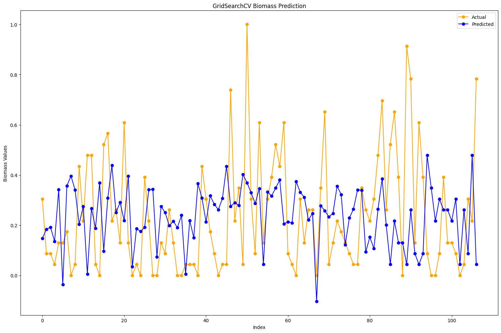
    - **Elastic Net**
    
    - **Lasso Regression**
    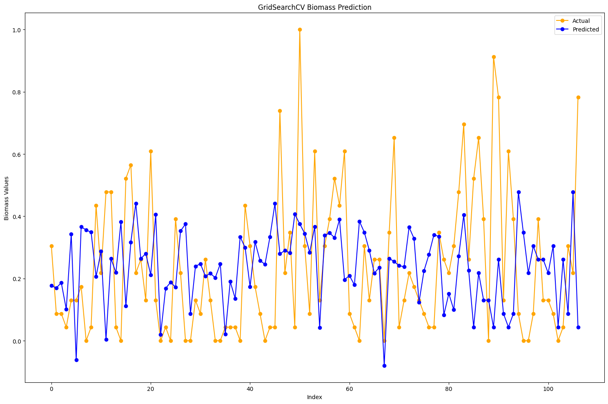

- **Reduced Features for Initial Dataset**
    - **Linear Regression**
    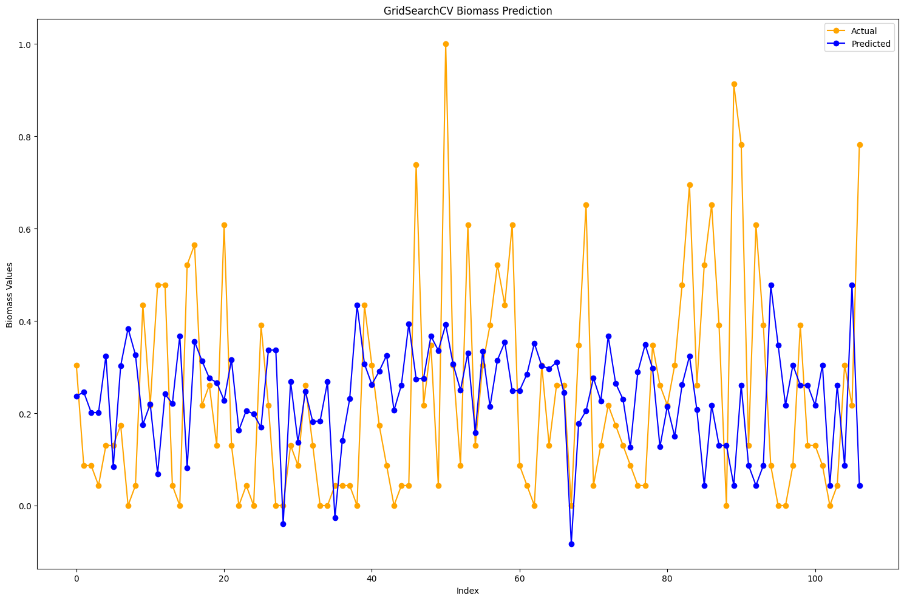
    - **Lasso Regression**
    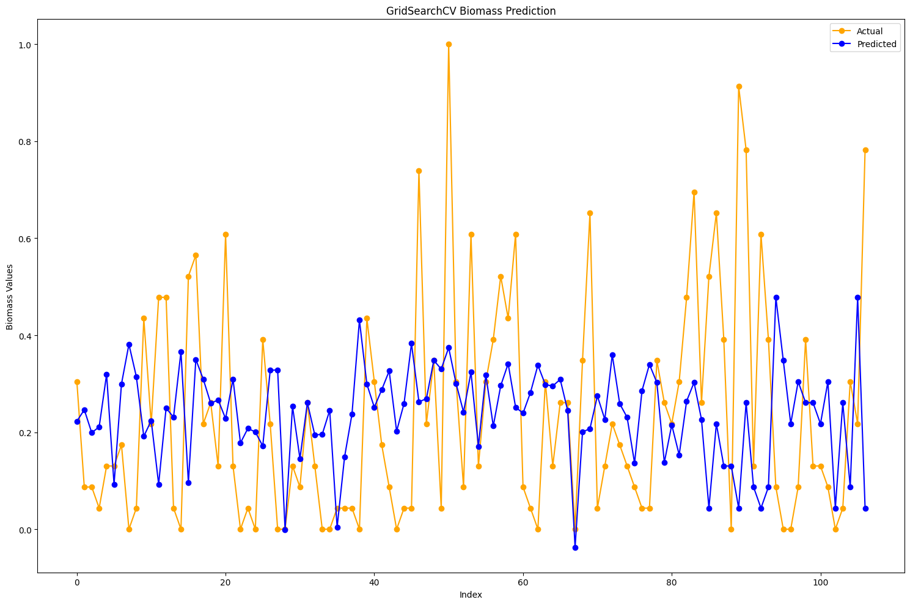
    - **Elastic Net**
    

- **Updated Features Dataset**
    - **Lasso Regression**
    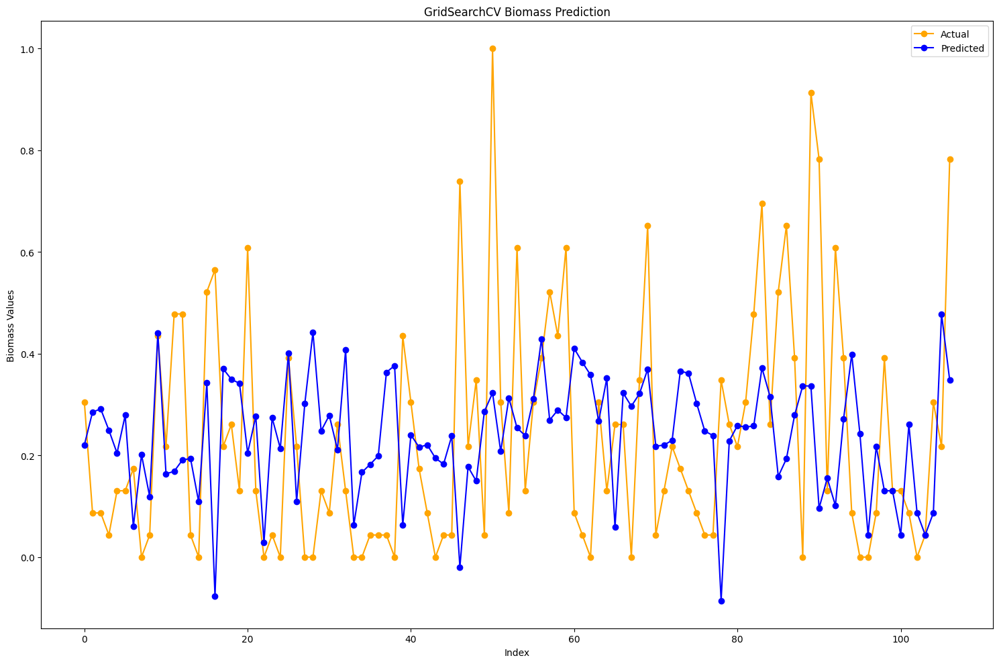
    - **Ridge Regression**
    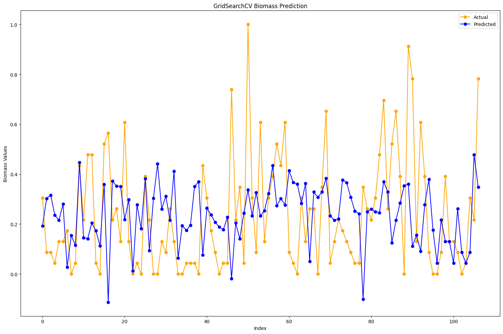
    - **Elastic Net**
    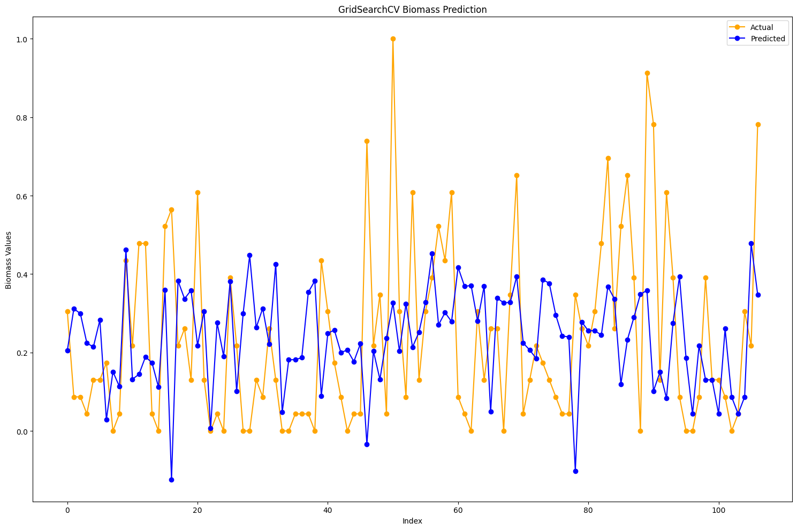

- **Reduced Features for Updated Features Dataset**
    - **ANN(MLP)**
    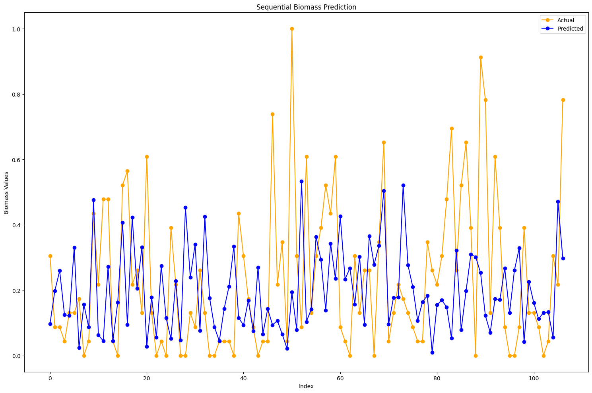
    - **Linear Regression**
    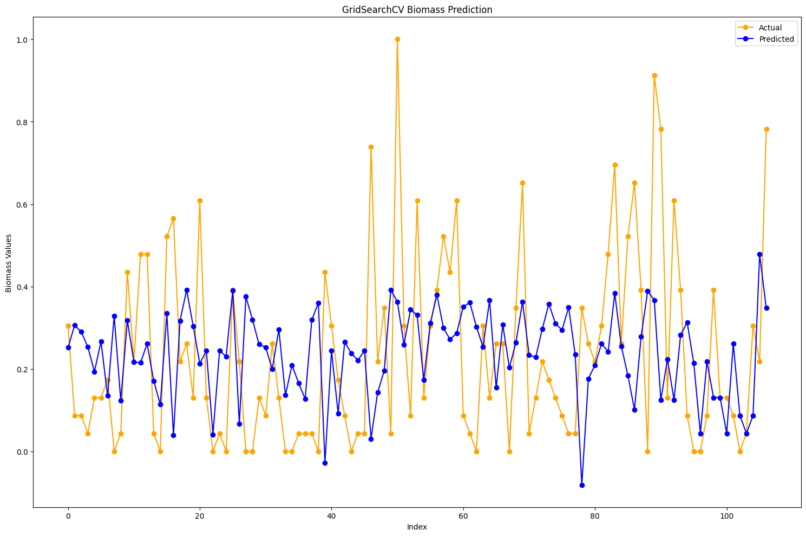
    - **Lasso Regression**
    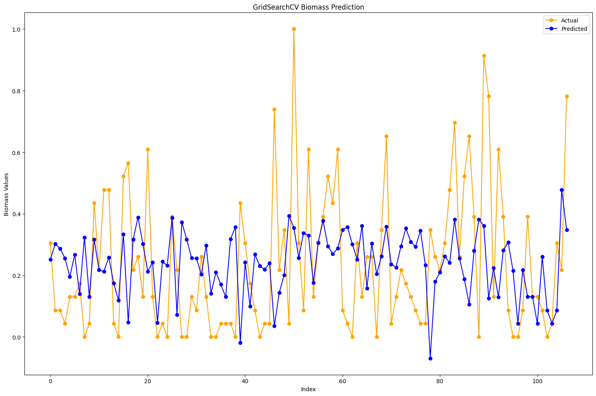

# Installation & Usage
1. Clone the repository
```bash
git clone <path>
```
2. Install the required packages
```bash
pip install -r requirements.txt
```
3. Run the main script

